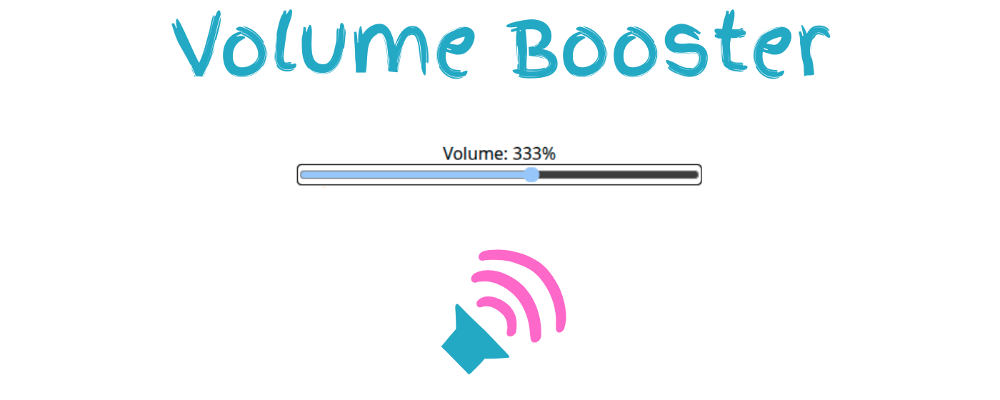
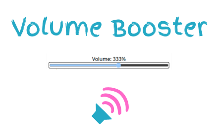
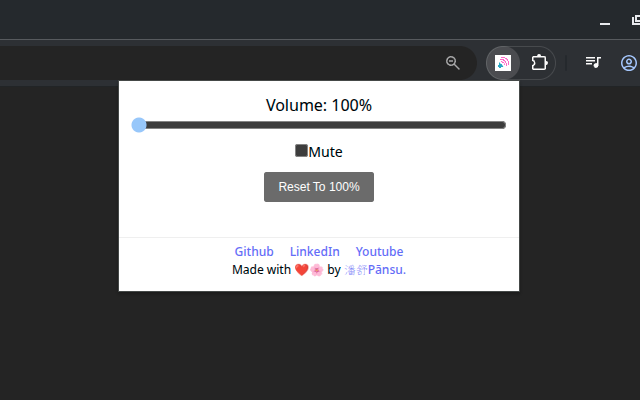
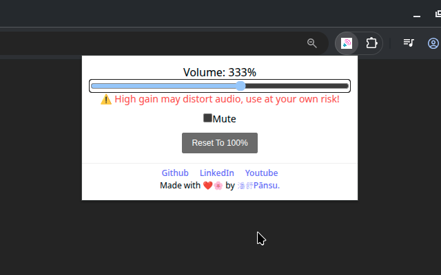

<div align="center">

# Volume Booster

### Boost the volume of videos and audio beyond the browser's normal limit.

Volume Booster is a lightweight browser extension that lets you increase the volume of audio and video playing in the current tab - up to **1000%**.

[](https://chromewebstore.google.com/detail/volume-booster/iobdhicnjoondkokmbibhaoagkcacmln)
[](https://developer.chrome.com/docs/extensions/develop/migrate/what-is-mv3)
[](LICENSE)

</div>

<p align="center">
  
</p>

---

## What is Volume Booster?

**Volume Booster** increases the maximum volume of videos and audio playing in your current browser tab.

Sometimes 100% simply isn't loud enough. Volume Booster lets you push the volume beyond the browser's standard limit and boost it up to **1000%**, making it useful for quiet videos, low-volume recordings, online courses, music, podcasts, and other browser-based media.

It is designed to be simple: open the extension, adjust the volume, and keep watching or listening.

> **Note:** Very high amplification can introduce distortion or crackling depending on the original audio and your speakers or headphones. Use high boost levels carefully.

## Preview

<table>
  <tr>
    <td></td>
    <td></td>
  </tr>
  <tr>
    <td></td>
    <td></td>
  </tr>
</table>

## Features

- **Volume boost up to 1000%** - go beyond the browser's normal 100% volume limit.
- **Current-tab audio control** - boost audio from media playing in the active tab.
- **Works with video and audio** - designed for browser-based media.
- **Simple volume control** - adjust amplification without complicated configuration.
- **Free to use** - available as a free Chrome extension.
- **No ads** - the published extension is advertised as ad-free.
- **No malware** - the project is intended to provide only its volume-boosting functionality.
- **Privacy-focused** - the Chrome Web Store disclosure states that the developer does not collect or use user data.
- **Lightweight** - built as a focused browser extension with a small set of permissions.

## How it works

```text
Play audio or video in a browser tab
              │
              ▼
       Open Volume Booster
              │
              ▼
      Increase the volume
              │
              ▼
      Audio is amplified
              │
              ▼
        Keep watching
```

## Use cases

### Quiet videos

Increase the volume when a video's original audio is too quiet.

### Online courses

Boost lectures, tutorials, and educational videos when the source recording has low audio levels.

### Podcasts and interviews

Make speech easier to hear when the recording has a low overall volume.

### Music

Increase browser playback volume when the standard output level is not enough.

### Older recordings

Get additional amplification from recordings that were produced at a lower volume.

## Installation

### Chrome Web Store

Install the published extension directly from the Chrome Web Store:

**Volume Booster:** https://chromewebstore.google.com/detail/volume-booster/iobdhicnjoondkokmbibhaoagkcacmln

### From source

Clone the repository:

```bash
git clone https://github.com/Nucletic/Volume-Booster.git
cd Volume-Booster
```

Install dependencies:

```bash
npm install
```

Start the development environment:

```bash
npm run dev
```

Build the Chrome extension:

```bash
npm run build
```

Create a distributable package:

```bash
npm run zip
```

The project also includes Firefox build and packaging commands:

```bash
npm run dev:firefox
npm run build:firefox
npm run zip:firefox
```

## Loading the extension locally

After building the extension:

1. Open `chrome://extensions`
2. Enable **Developer mode**
3. Click **Load unpacked**
4. Select the generated extension directory
5. Open a webpage with audio or video
6. Open Volume Booster and adjust the volume

## Usage

1. Open a webpage containing audio or video.
2. Start playing the media.
3. Open the **Volume Booster** extension.
4. Increase the volume above the normal 100% level.
5. Adjust the boost until the audio is comfortable.

The extension is intended to work with media playing in the current browser tab.

## Volume levels

| Level | Effect |
| --- | --- |
| `100%` | Normal browser volume |
| `200%` | 2× the normal level |
| `400%` | 4× the normal level |
| `800%` | 8× the normal level |
| `1000%` | 10× the normal level |

The actual perceived loudness depends on the source audio, device, operating system, speakers, headphones, and other audio processing.

## Permissions

The extension currently declares:

| Permission | Purpose |
| --- | --- |
| `tabCapture` | Accesses audio from the current browser tab |
| `offscreen` | Supports audio processing outside the visible extension UI |
| `storage` | Stores extension settings |

The project uses these permissions as part of its tab-audio amplification workflow.

## Privacy

The Chrome Web Store disclosure states that the developer does **not collect or use user data**.

The extension's privacy policy is available here:

https://volume-booster-ext.netlify.app/

## Audio safety

Amplifying audio beyond its original level can introduce clipping, distortion, or crackling.

Use higher boost levels carefully, particularly with headphones or speakers at high output levels.

Volume Booster does not guarantee that every audio source will remain distortion-free when heavily amplified.

## Tech stack

- React
- TypeScript
- WXT
- Vite
- Chrome Extensions Manifest V3
- Chrome `tabCapture` API
- Chrome `offscreen` API
- Chrome Storage API
- Lucide React

The repository also contains Firefox development and packaging commands through WXT.

## Project structure

```text
Volume-Booster/
├── assets/
├── entrypoints/
├── output/
├── public/
│   ├── icons/
│   └── store-screenshots/
│       ├── 1400x560.png
│       ├── 440x280.png
│       ├── screenshot1.png
│       ├── screenshot2.png
│       └── 512x512.png
├── LICENSE
├── package.json
├── package-lock.json
├── tsconfig.json
├── wxt.config.ts
└── README.md
```

## Development scripts

| Command | Purpose |
| --- | --- |
| `npm run dev` | Start WXT development mode |
| `npm run build` | Build the Chrome extension |
| `npm run zip` | Create a distributable Chrome package |
| `npm run compile` | Type-check the project |
| `npm run dev:firefox` | Start Firefox development mode |
| `npm run build:firefox` | Build for Firefox |
| `npm run zip:firefox` | Package the Firefox build |

## Contributing

Contributions, bug reports, and feature ideas are welcome.

To contribute:

1. Fork the repository.
2. Create a feature branch.
3. Make your changes.
4. Run the type check and build.
5. Test the extension locally.
6. Open a pull request with a clear description.

Before submitting changes:

```bash
npm run compile
npm run build
```

## Roadmap

Potential improvements include:

- [ ] Improved compatibility with more media players
- [ ] More granular volume controls
- [ ] Smoother audio transitions
- [ ] Per-site volume preferences
- [ ] Additional keyboard controls
- [ ] Improved handling of multiple audio sources
- [ ] More detailed audio status information

## License

Volume Booster is open source and available under the **MIT License**.

See [LICENSE](LICENSE) for the full license text.

---

<div align="center">

**Volume Booster**

More volume when 100% isn't enough.

[Chrome Web Store](https://chromewebstore.google.com/detail/volume-booster/iobdhicnjoondkokmbibhaoagkcacmln) · [GitHub](https://github.com/Nucletic/Volume-Booster)

</div>
